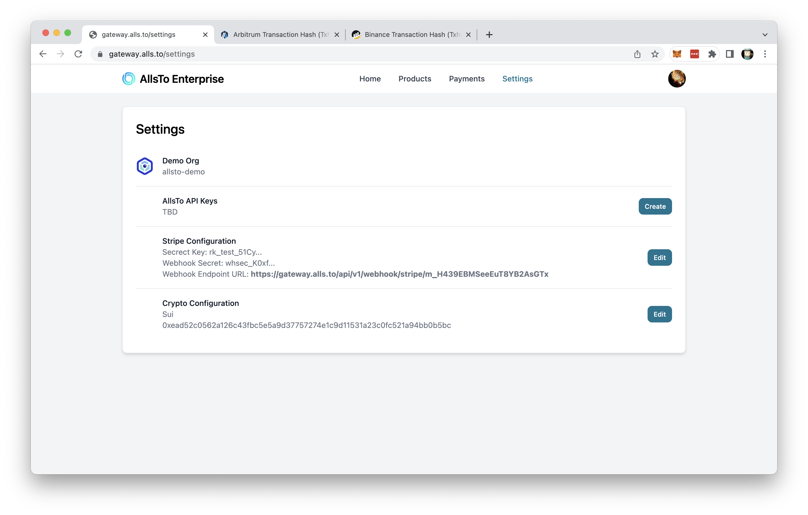

# Integration Tutorial

## Accessing Management Dashboard 

## Product Management

### Add or Edit a Product Listing

To edit existing product listing, click **Edit** on the right of the product listing to be edited. Change the information as required. Click **Confirm** to save the entry. Click **Cancel** to cancel this entry.

### Test Payment
.

## Payment History

## Settings

Click on **Settings** to access settings page. In settings page, you may view or edit the organization information such as name, API key, payment engine API keys and Crypto configuration.

