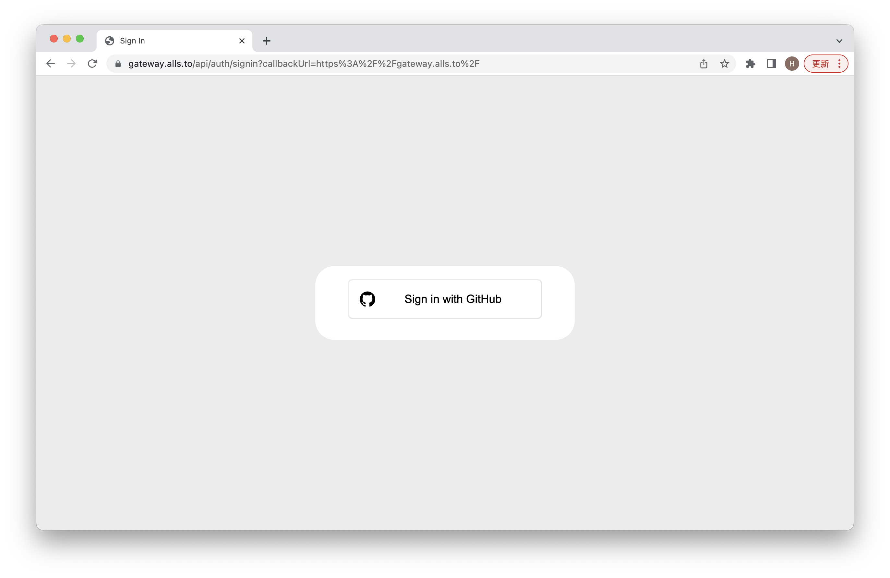

# Management Dashboard Account Creation

## Sign in Using Github
Go to allsto [Management Dashboard](https://gateway.alls.to), click on the Log in button and sign up with github:

If you are the **first-time user**, you may see nothing except a white screen. This is because you **need to register your management dashboard account first**.  

## Register Information needed

As for now, Allsto adopts manual input of business's information. To successfully record the information needed, the business needs to send Allsto team their **Account Email**, **Company Name**, **Icon**, and **the Desired Name in Search Link** (must only be consisted of lower case letters and hyphen) after the first signing in using Github.

## Log-in Success

After receiving the registration confirmation by Allsto team, click on the account at top right corner, sign out and re-sign in to get the full access **(No need to re-sign in every time, only for the first-time account activation)**

