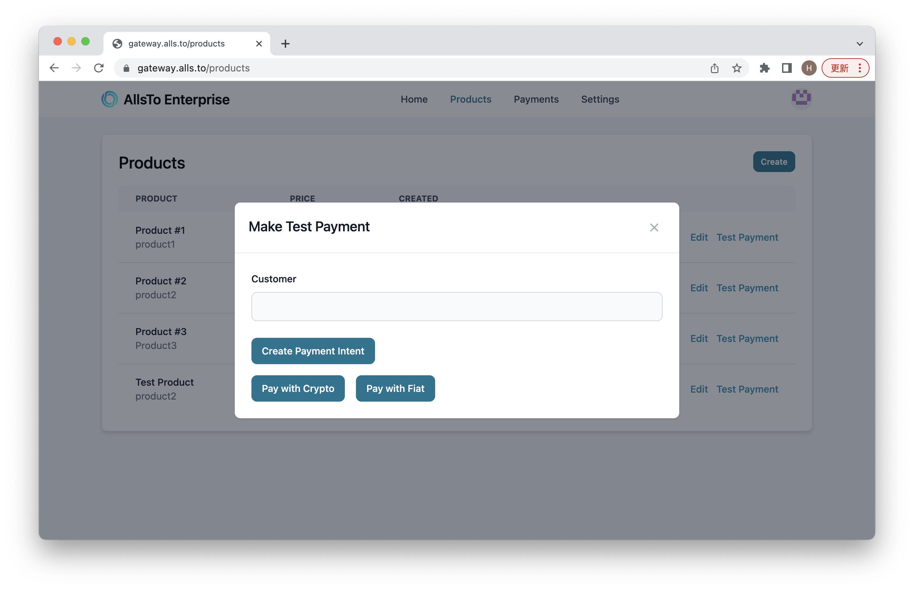

# Payment Test

To test the payment, click on the **Test Payment** 

Enter the customer payment, then click to pay with Fiat or Crypto. We recommend using **Fiat** to test the payment, since crypto is deployed on mainnet, which means **real transactions will happen**, whereas fiat payment is deisgned for testing, and no real money will be paid. **Notice that the price being set here is measured in US dollar**.

To track payment history, go to payments page:

If the payment is initiated but not paid, the record will expire in an hour, but processed payments will not expire. 