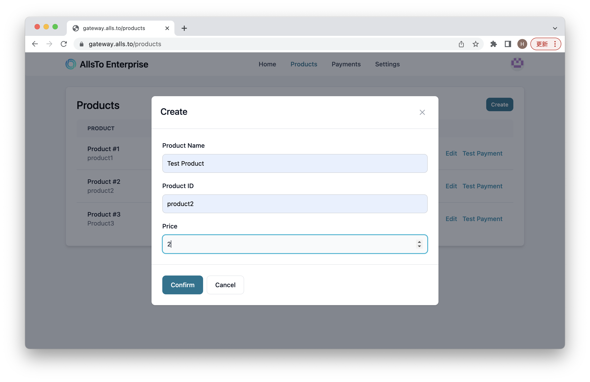

# Products Creation

To create products, the business needs to orient to product page and click the create button:

Then enter the name, id, and price of the product. The product id should be consist of **only lower case letter and hyphen** since it will appear in links. After entering all information, click on the confirm button.

