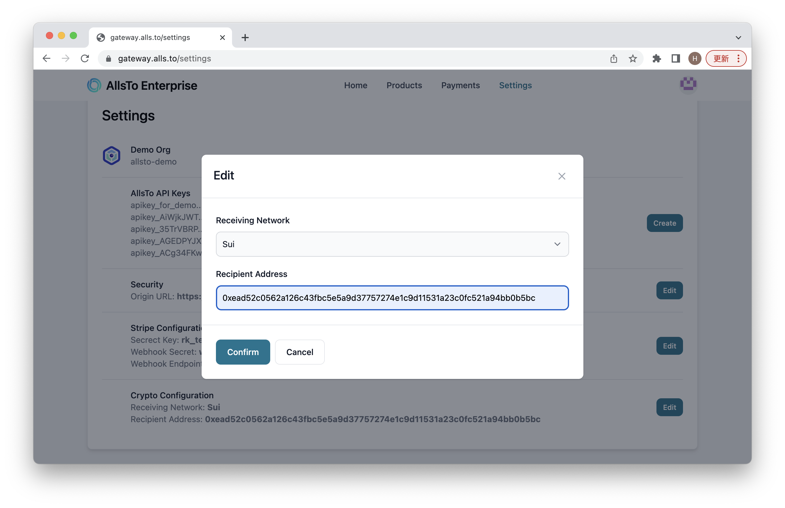

# Settings

Now the business need to click on setting and change some configurations.

## API Keys

Click on create button in the section of **Allsto API keys** to get your API key. Notice that the key will **only show up once**. Be sure to save your key beofre close the pop-out window. For the current version keys cannot be deleted once being created, but in the future version we will enable the key deleting function.

## Original URL

Then click on the Edit button in security section to modify your original url. This URL will direct users to payment page, so the business will need to set their own URL.

## Stripe Configuration

Follow the [Stripe Configuration](../connection/stripe.md) to finish the stripe payment setting.

## Crypto Configuration

Finally, make sure to set your recepient chain and address under **Crypto Configuration** section:

