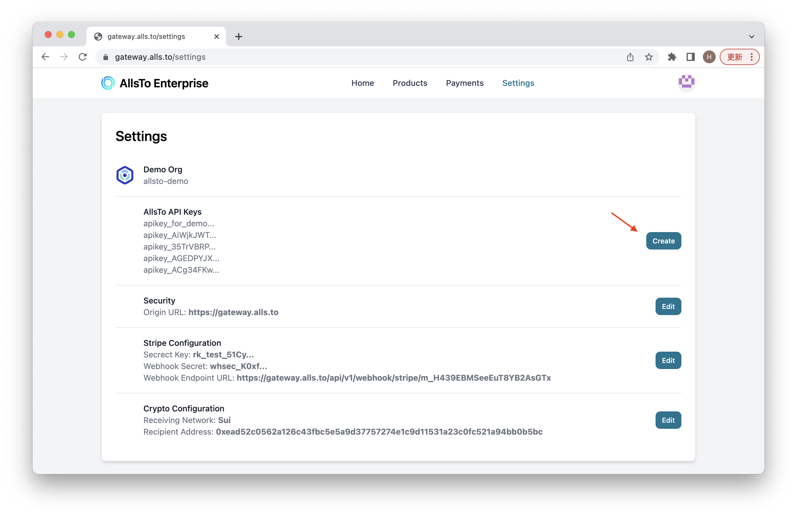

# Settings

Now the business need to click on setting and change some configurations.

## API Keys

Click on create Icon inside the row of **Allsto API keys** to get your API key. Notice that the key will **only show up once**. Be sure to save the key beofre close the page. For the current version the keys cannot be deleted once being created, but in the future version we will enable the deleting function.

## Original URL

This URL will direct users to payment page, so the business will need to set their own URL

## Stripe Configuration

Follow the [Stripe Configuration](../connection/stripe.md) to finish the stripe payment setting.

## Crypto Configuration

Also make sure to set your receving chain and address under **Crypto Configuration**:

