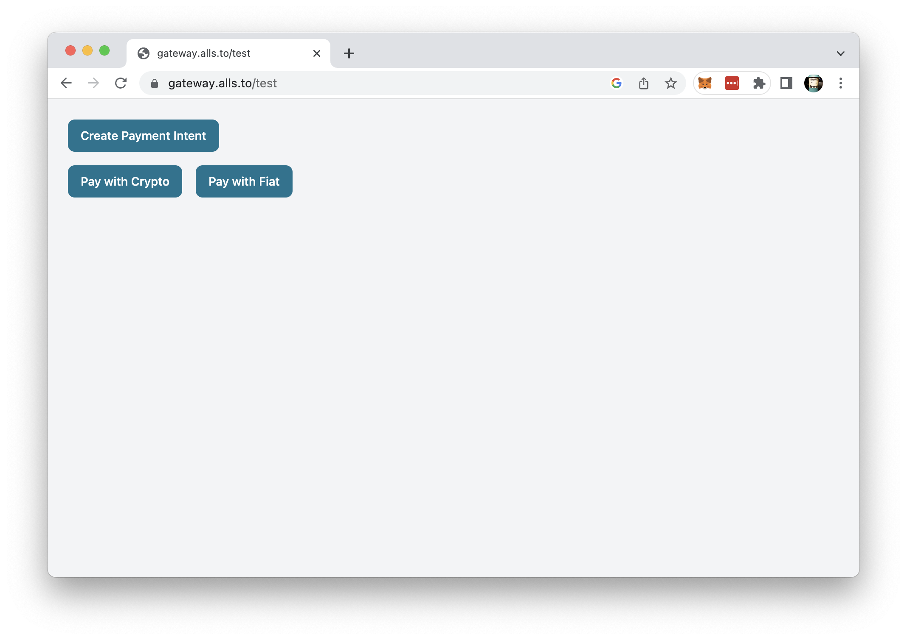
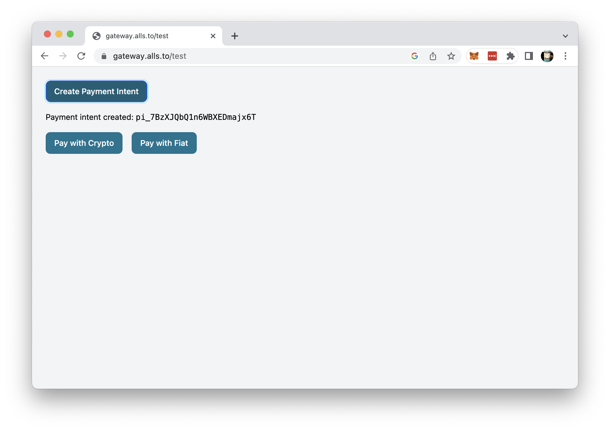
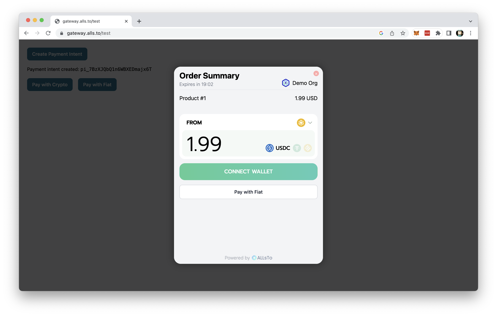
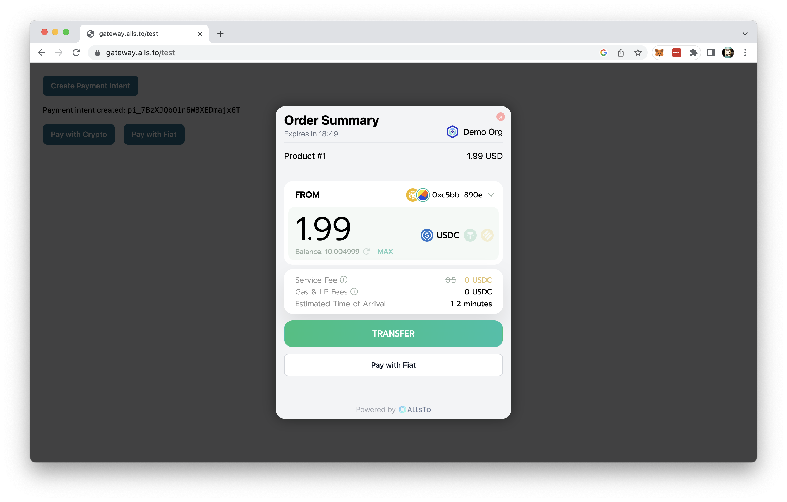
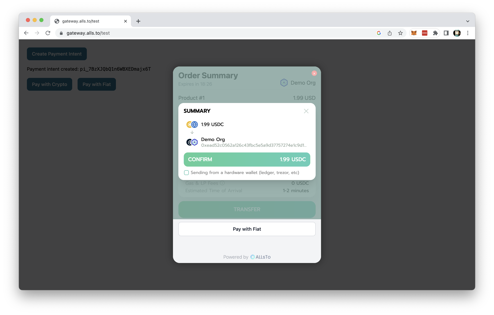
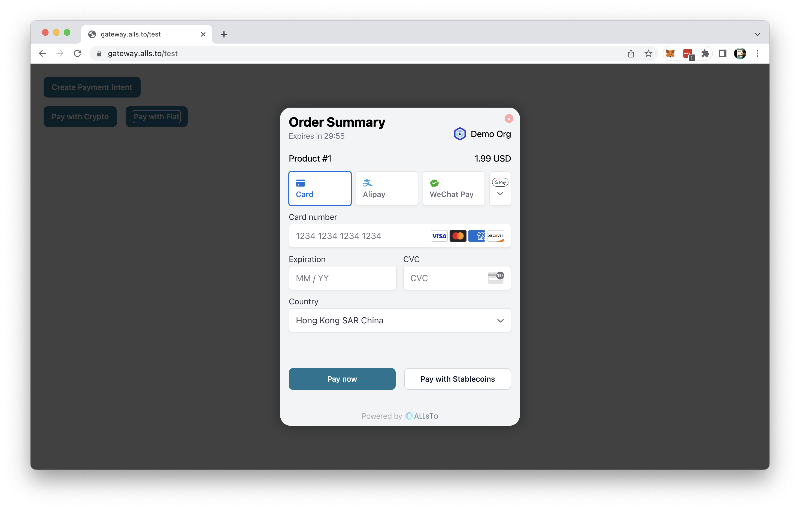
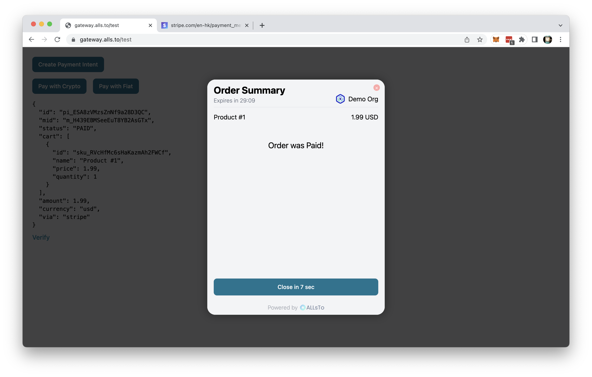

# Payment Flow

## Create a Payment Intent 

Please note, this is demo function only in order to create a valid payment order for AllsTo to proceed on processing the payment. In production environment, this will be replaced by creation of the order.

Visit https://gateway.alls.to/test to start and click on **Create Payment Intent**.

When a receipt number is shown below **Create Payment Intent** button, A Payment Intent is successfully created.

## Pay with AllsTo

Visit https://gateway.alls.to/test to start,please make sure that you have a valid payment intent before you proceed, otherwise follow [Create a Payment Intent](./#Create-a-Payment-Intent) to create one.

You will have the options of **Pay with Crypto** or **Pay with Fiat** to pay on AllsTo.

* [Pay with Crypto](./#Pay-with-crypto)
* [Pay with Fiat](./#Pay-with-fiat)

## Pay with Crypto
Click **Pay with Crypto** to proceed paying with crypto. In the popup window, select the blockchain you wish to pay from the list next to **FROM** and select the stablcoins by icon you wish to pay from next to the payment amount. You will have the option to switch to **Pay with Fiat** at this stage.

Click on **Connect Wallet** to connect with the non-custodial wallet you have installed on your browser.

Once wallet is connected, a order summary will be shown. Please verify all details, including fee and transaction time before you proceed on payment. The payment is irreversible once payment is submitted. Click on **TRANSFER** to proceed. 

Verify again the payee information, and tick the checkbox if you're using hardware wallet. Click on **CONFIRM** to submit the payment to the blockchain.

Blockchain Payment usually takes 1-2 minutes to process, once completed, the popup window will notify the user and redirect to the order completion page.

## Pay with Fiat
Click **Pay with Fiat** to proceed paying with crypto. In the popup window, select payment methods you desired and fill in the information required. You will have the option to switch to **Pay with Stablecoin** at this stage.

Click on **Pay Now** to proceed on payment as instructed.

Once completed, the popup window will notify the user and redirect to the order completion page.

