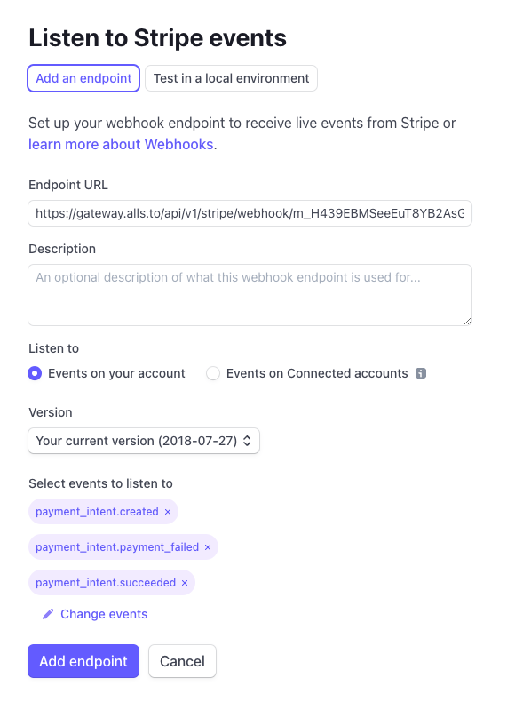
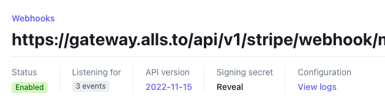

# Stripe Configuration

If you want to accept fiat currency payments using AllsTo Enterprise, users need to set up their own Stripe account and go through the enterprise verification process. They will then need to provide AllsTo with certain necessary API keys. It's important to note that AllsTo Enterprise only requires **limited permission** Stripe API keys to complete the payment process, so users don't need to worry about sharing API keys that would expose too many permissions. The specific details will be explained in the following sections.

## Secret Key

To use the Stripe SDK, you need to provide a Secret Key. AllsTo Enterprise will use the **Restricted keys** provided by Stripe because they allow for setting operational permissions for the keys.

In your Stripe account, go to *Developers* -> *API keys* and create a new key under **Restricted keys**. AllsTo Enterprise only requires the *Write* permission for PaymentIntents. This permission will be used to create new payment requests and retrieve existing payment requests.

After creating the key, fill it into the Secret Key field in the AllsTo Enterprise -> *Settings* -> *Stripe Configuration* section.

## Webhook Key

When Stripe processes transaction flows, it pushes updates on transaction status through webhooks. To handle transaction status updates, including successes and failures, AllsTo Enterprise needs to use a **Webhook Key**.

In your Stripe account, go to *Developers* -> *Webhooks* and create a new endpoint.

Please refer to the screenshot for configuration. Your account's dedicated Endpoint URL can be found in AllsTo Enterprise -> *Settings* -> *Stripe Configuration*. Fine-grained permission control is also supported there; you only need to provide the three event permissions shown in the screenshot.

After creating the endpoint, click on *Reveal* to view your Signing secret, and fill that secret into the **Webhook Key** field in the AllsTo Enterprise -> *Settings* -> *Stripe Configuration section*.
