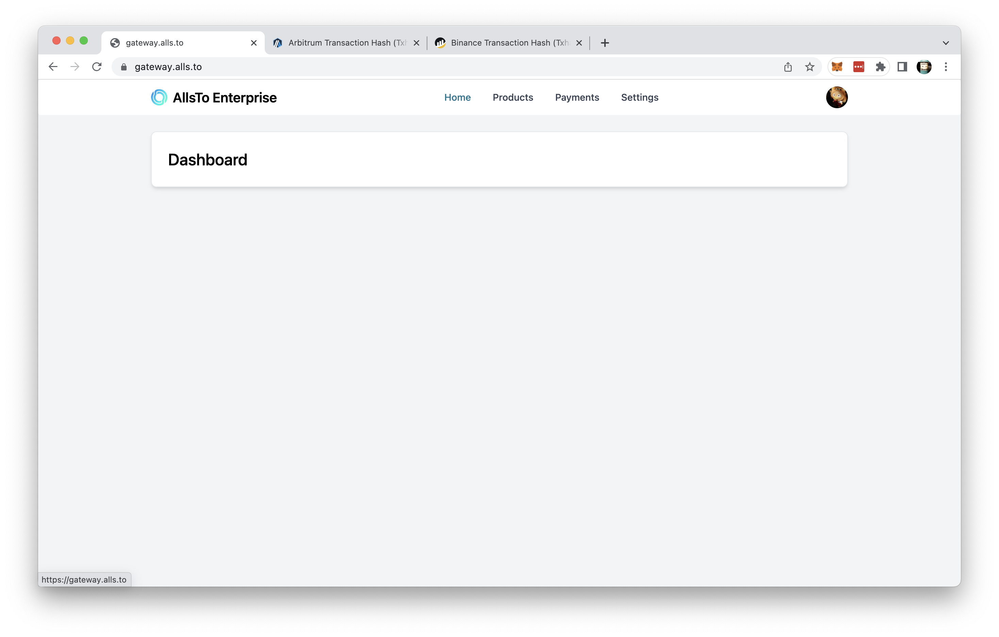
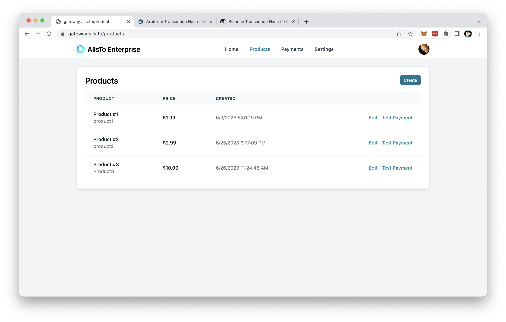
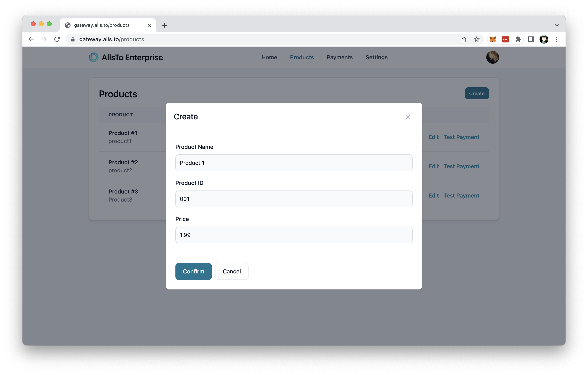
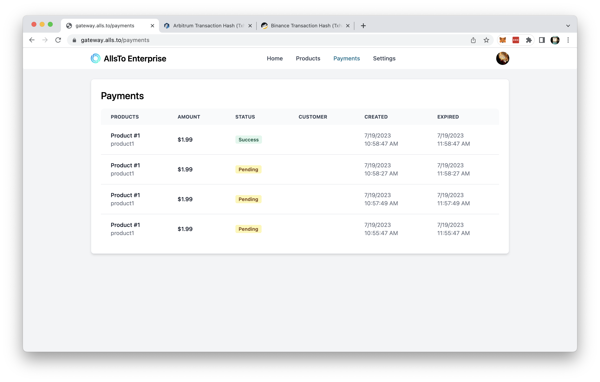
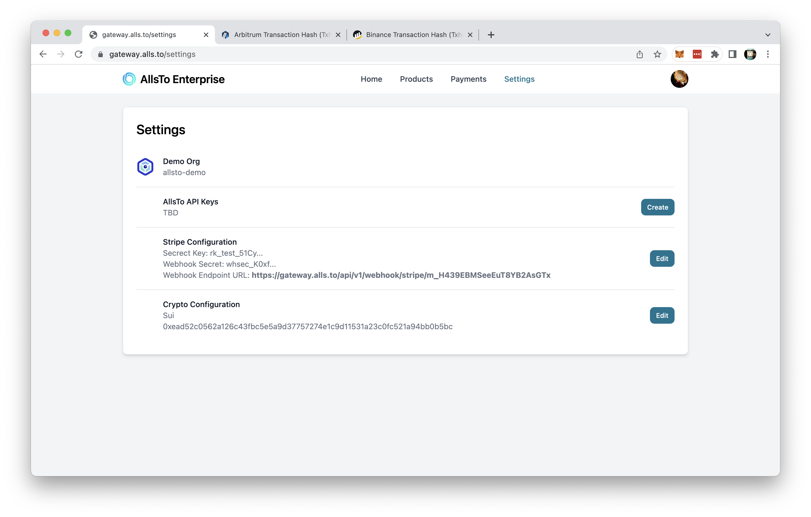

# Management Dashboard

## Accessing Management Dashboard 

Visit https://gateway.alls.to/ and login with your github account login to access the management dashboard. If you receive error while login, contact the team to grant you access to the dashboard.

## Product Management

Click on **Product** to access product management page. In product management page, you may manage your product listing, including name, ID and pricing. Click **Create** to add a new product listing, click on **Edit** to edit the product details and click on **Test Payment** to test payment using the specified product.

### Add or Edit a Product Listing

To add a new product listing entry, click **Create** to add a new product listing. Fill in the required information, such as product name, product ID and pricing. Click **Confirm** to save the entry. Click **Cancel** to cancel this entry.

To edit existing product listing, click **Edit** on the right of the product listing to be edited. Change the information as required. Click **Confirm** to save the entry. Click **Cancel** to cancel this entry.

### Test Payment
On the right of each product listing, click on **Test Payment** to test payment using the specified product. Refer to [AllsTo Payment Flow](../allsto/payment_flow.md) for more details.

## Payment History

Click on **Payment** to access payment history page. In payment history page, you may view all payment history, including the product, amount, status, customer and time information.

## Settings

Click on **Settings** to access settings page. In settings page, you may view or edit the organization information such as name, API key, payment engine API keys and Crypto configuration.

